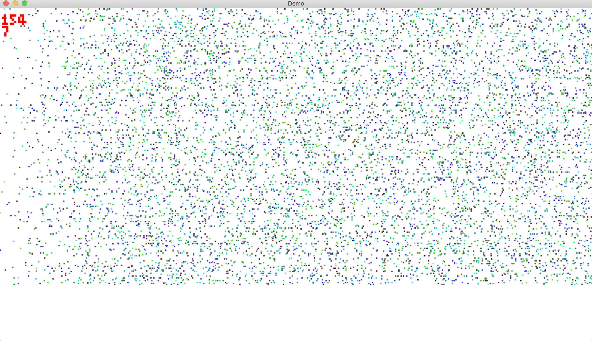

# LibECS

An entity component system written in C using a limited number of c libraries
for self education purposes.

I've tested the performance with a million simple square entities moving (1 pixel sized) on screen at 24fps with 2017 macbook pro, but not more than that unless I end up using this in my projects (Usually I don't make anything that I don't use, but this ECS project was done to learn the ECS concept, and possibly to be used in school 42 projects if deemed useful :D).

## Run

```
git clone https://github.com/hakolao/ecs.git && cd ecs
make demo_squares # runs a visual demo, if you wish to edit parameters, go to demo/demo_squares/include/demo_squares.h
# Or if you're courageous, try the simple raytrace attempt:
make demo_raycast # Just an attempt to place rays as entities to the world...
make test # runs tests
```



## Use

```
make # creates libecs.a that you an include in your libs, include libecs.h at ./include
```

Save space by deleting demo folder.

## Library usage

`demo/` should give you an idea how this works, but here is a short guide:

Structs & enums must be defined to be used by the library functions. At least
component ids & corresponding components, and system ids.

```c
/*
** Demo components (to be used by each entity)
*/

typedef struct s_position
{
	float x;
	float y;
} t_position;

typedef struct s_velocity
{
	float dx;
	float dy;
} t_velocity;

/*
** Component identifiers, should be powers of 2 and ULL for valid component
** ids.
*/

typedef enum e_comp_id
{
	comp_empty = 0ULL,
	comp_pos = 1ULL,
	comp_vel = 1ULL << 1,
} t_comp_id;

/*
** System ids.
** If a system should not be run with other systems, its id should not be 0
*/

typedef enum e_system_id
{
	system_move = 111
} t_system_id;
```

1. Create world initializes the world struct.

```c
t_ecs_world *world = ecs_world_create("Demo world", MAX_ENTITIES);
```

2. Create systems which must include components the system uses and system
   handle functions. See `demo/demo_system.c` on what the render handles could look
   like.

```c
static void system_movement_handle(t_ecs_world *world, uint64_t entity_index)
{
	t_app *app;
	t_position *pos;
	t_velocity *vel;

	app = (t_app*)ecs_world_system_get(world, system_move).params;
	pos = (t_position*)ecs_world_entity_component_get(world, entity_index, comp_pos);
	vel = (t_velocity*)ecs_world_entity_component_get(world, entity_index, comp_vel);
	pos->x += vel->dx * app->info.delta_time;
	pos->y += vel->dy * app->info.delta_time;
}

ecs_world_system_add(app->world, (t_system){
	.system_id = system_move,
	.components_mask = comp_pos | comp_vel,
	.system_handle_func = system_movement_handle,
	.params = app
});
```

3. Create entities with initial components they have. Components can be added
   afterwards as well.

```c
void entities_create(t_app *app)
{
	int32_t i;
	int32_t size;

	i = 1;
	while (app->world->num_entities < MAX_ENTITIES)
	{
		size = 3;
		ecs_world_entity_add(app->world, 3,
			&(t_component){.id = comp_pos, .size = sizeof(t_position),
				.data = &(t_position){.x = i,.y = 1}},
			&(t_component){.id = comp_vel, .size = sizeof(t_velocity),
				.data = &(t_velocity){.dx = 1, .dy = 1}},
			&(t_component){.id = comp_render, .size = sizeof(t_render),
				.data = &(t_render){.color = i, .width = size,
					.height = size, .window = &app->window}});
		i = ft_rand(i);
	}
}
```

4. Run Systems (this would usually happen each game loop, but can be run only once too).
   Systems can be run parallel as well, however make sure to keep components decoupled in that case.
   E.g if you modify z buffer while also coloring pixels, be sure to see some weird artifacts.

```c
// multiple systems inputted like: system_move | system_render
ecs_systems_run(app->world, system_move);
ecs_systems_run_parallel(app->thread_pool, app->world, system_move);
```

5. Update system params if needed, e.g. delta time. Though before ecs_systems_run.
   You can pass anything, but via app in this example e.g. window & framebuffer can be accessed.

```c
ecs_system_update_params(app->world, system_move, app);
```
